# Game hacking - Cheat Engine  - Chapter 2 - Write-up

The ball is hidden in the other half of the screen and you have to make the ball appear. Simple enough!? Let's go.

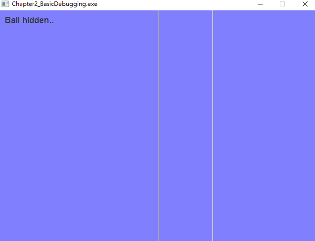

Search for &gt; All Modules &gt; String references: Search "Ball hidden..". Finding out the string located at 00711252, we go to the target address and look for any if statement

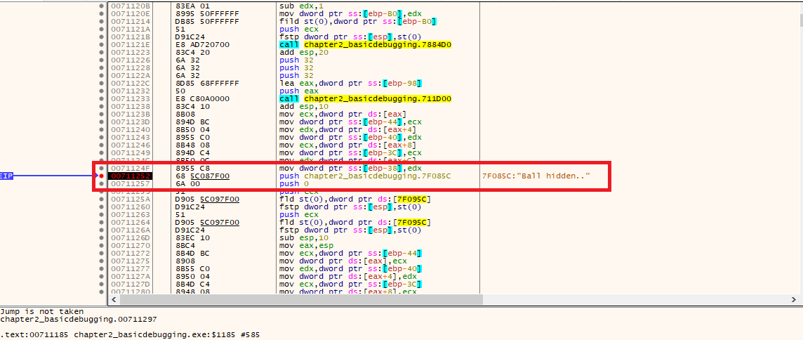

Condition statement is found. \(Changing the view to graphic mode to have a better look on the code\)

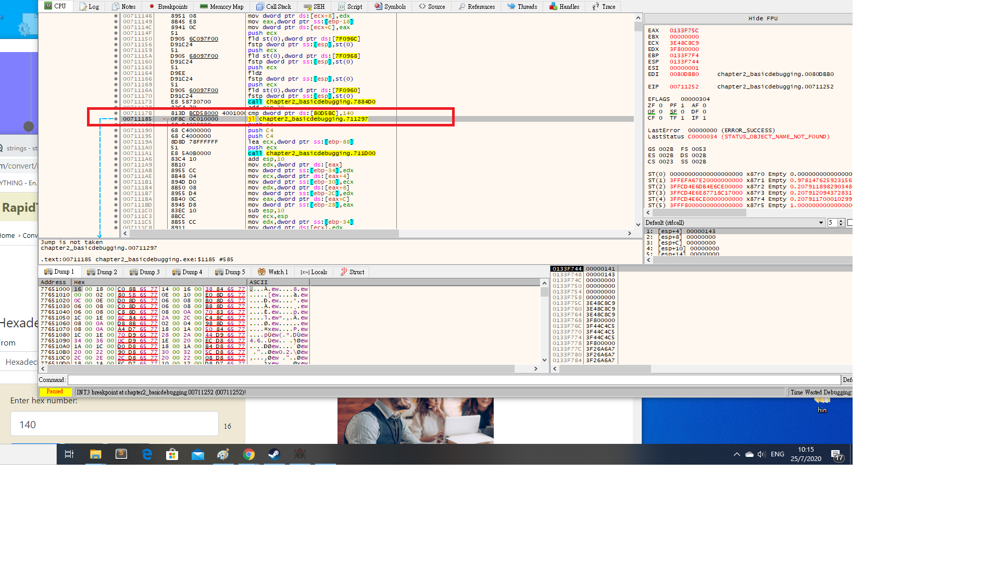

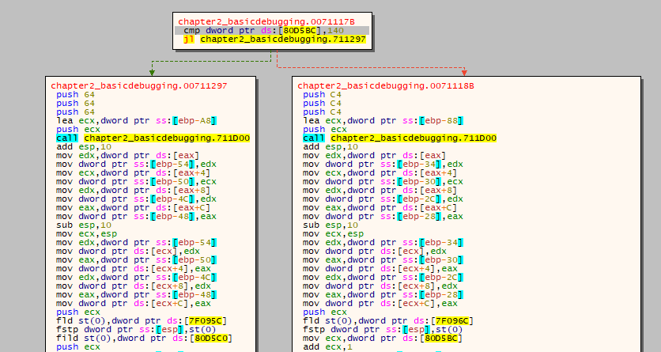

\[80D5BC\] is the variable controlling the hidden statement. Deep drive into it, we found out that \[80D5BC\] is a variable with 0X27A as its maximum and A as its minimum. With an increment value keep on adding\(+1/-1\) to \[80D5BC\], we suspect this is the ball X coordinate variable.

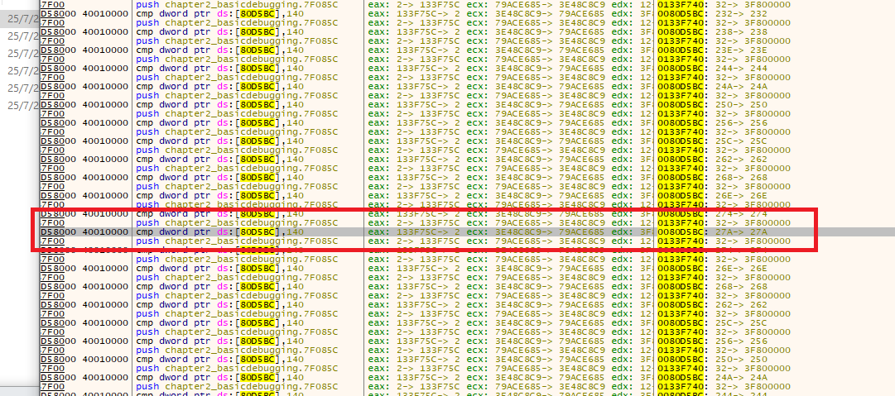

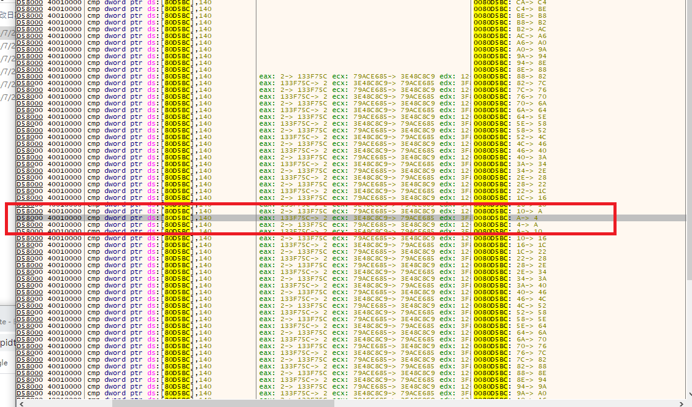

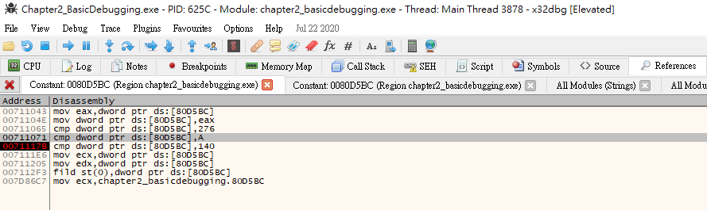

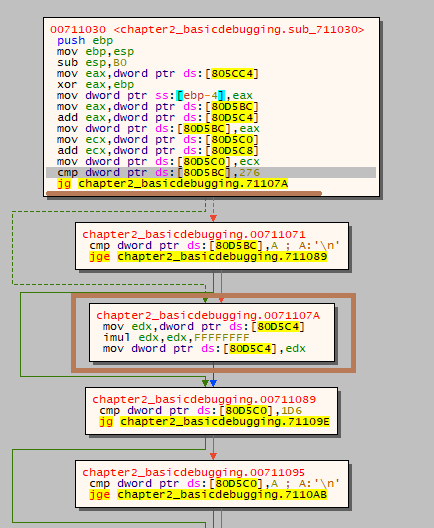

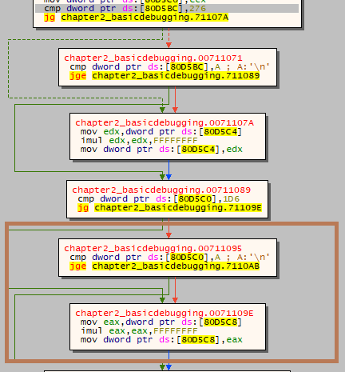

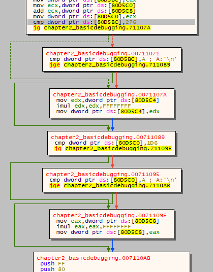

Now, the picture is quite clear. \[80d5c4\] = incremental in x, \[80d5BC\] = x coordinate, \[80D5C8\] = incremental in y, \[80D5CO\] = y coordinate.

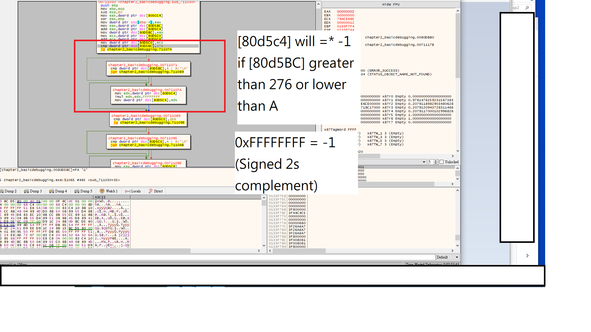

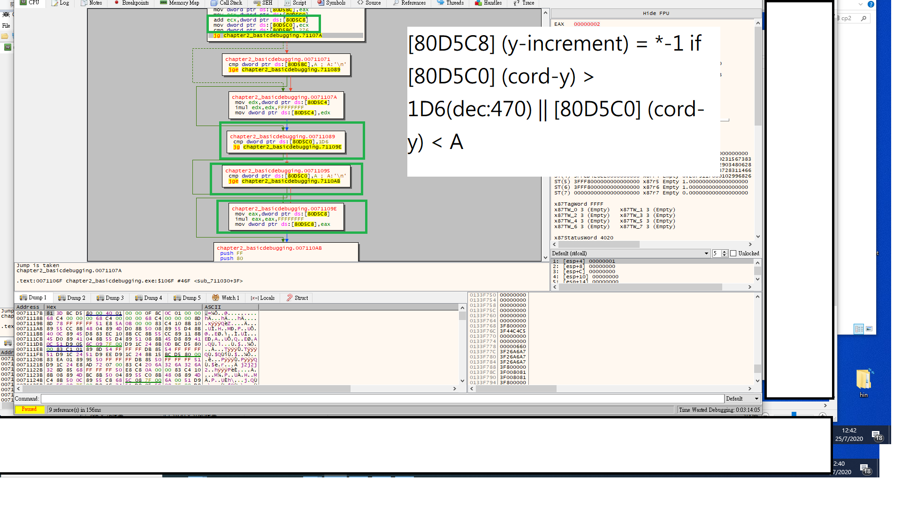

> Change the compare value to 0XFFFFFFFF, in that case, hidden ball call will never be triggered.

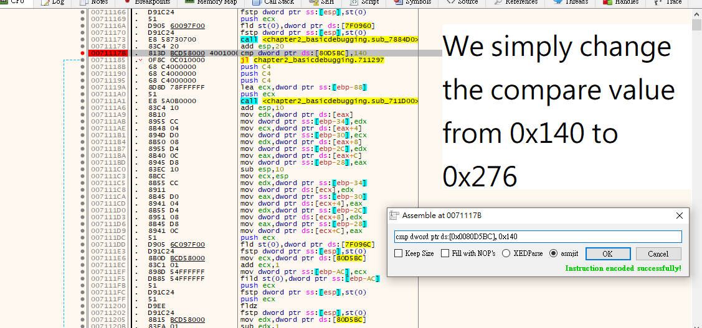

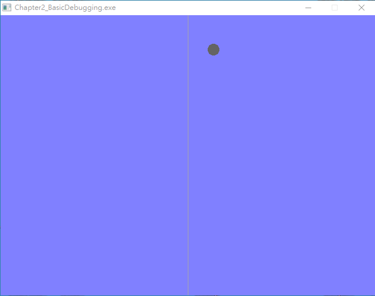

 

