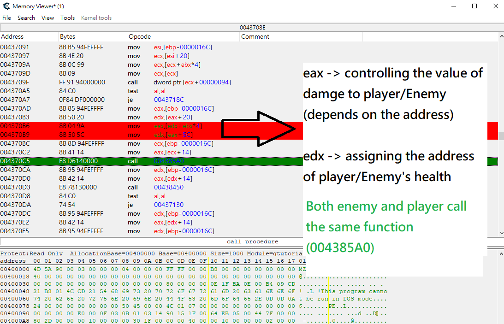

# Game hacking - Cheat Engine - CE Game tutorials -Step2 - Feedback

The technique used by this game is same as \([https://app.gitbook.com/@econgamer/s/reverse-engineering/~/drafts/-MDJF9b8VhSHvowOCqt4/untitled](https://app.gitbook.com/@econgamer/s/reverse-engineering/~/drafts/-MDJF9b8VhSHvowOCqt4/untitled)\), where you can't simply change the damage value on one assembly instruction, say like, "mov EAX,EDX". As players and enemies both call the same function\(call 004385A0\), with different parameters \(EAX and EDX\). You have to go backward and track back to where those params \(EAX and EDX\) are assigned. After realizing this concept, you can easily solve it by yourself.

