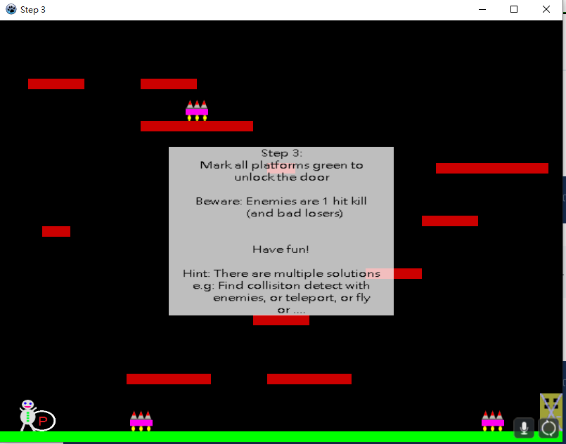
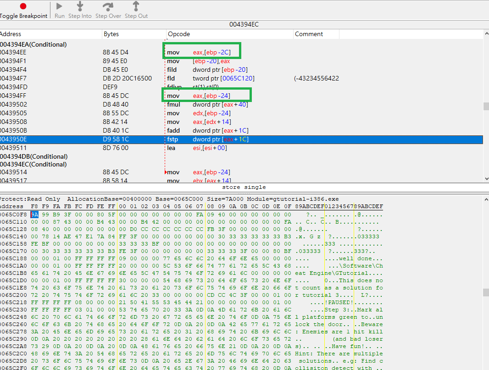
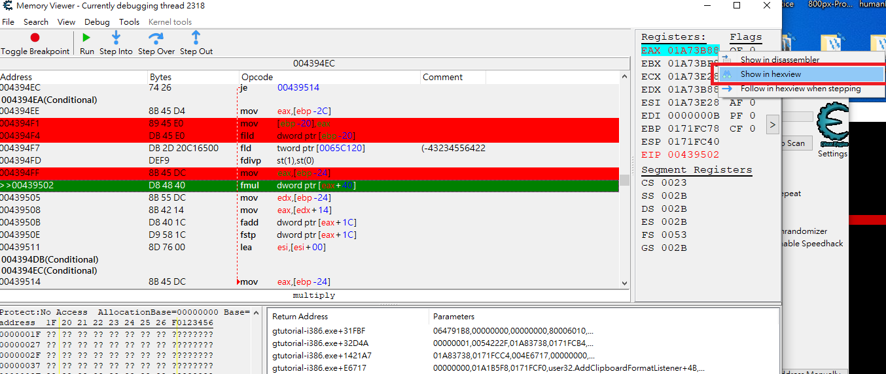
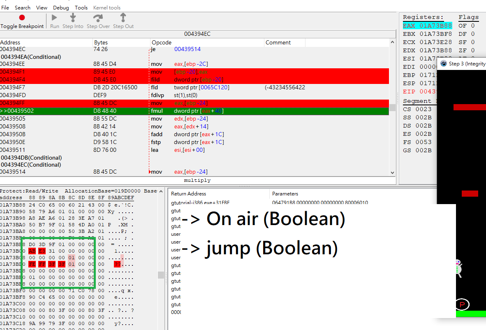
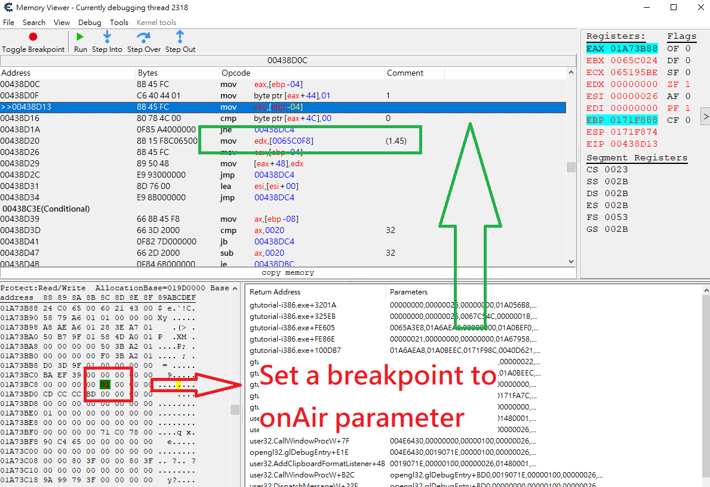

# Game hacking - Cheat Engine - CE Game tutorials - Step3 - Write-up

Check if any parameters that we can make us of. At the beginning, I can think of characters' movement is the easiest one to scan. 

I have found players x coordinate and I keep track of what writing to its address whenever x movement of player is triggered.

Going into the addresss, scanning through the code, ebp is something I would look into first as I am interested in learning about what parameters is passing through to the movement function.

Also, noticing that there are always other parameter that will be found on ebp+x, thus, there are no reasons why don't give it a check.     

Going to ebp \(address\) in hexview

Found it! Those are the parameters we are looking for and I have played around and discovering that when player jump, the following memory will change as well

Setting a breakpoint to OnAir parameter, tracing the writing access, following the address. mov edx,\[0065C0F8\] is wired to me as gloabl variable is used and I guessed it would be an important parameter to jumping action. After testing around, \[0065C0F8\] turns out to be the variable controlling the jumping distance. Setting a higher value allows us to jump higher to get all collisions to turn into green color. 

After unlocking the door, all the enemies will relocate to the door and block it from the player. Remember that we have find the address of player's x-coordinate at the beginning, it's time to change the value and relocate the player into the door position \(you can do it by trial-and -error\). We break the game. Well done!

