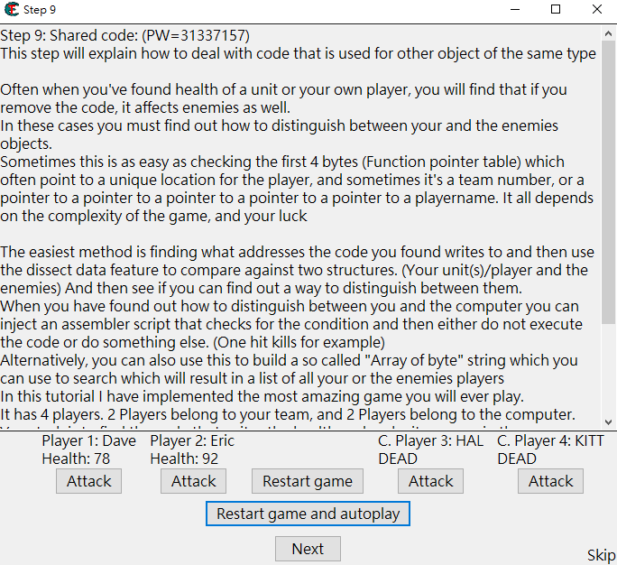
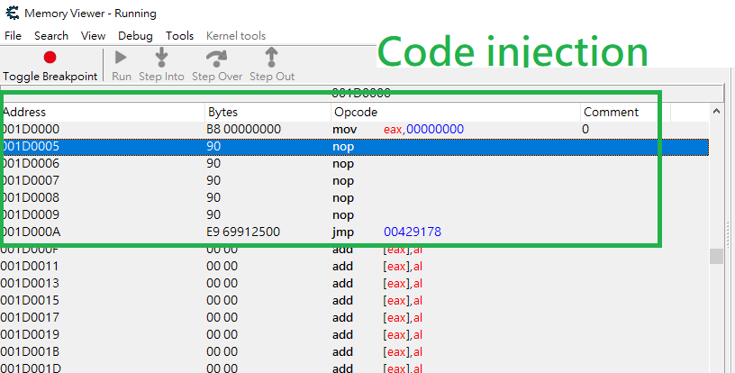
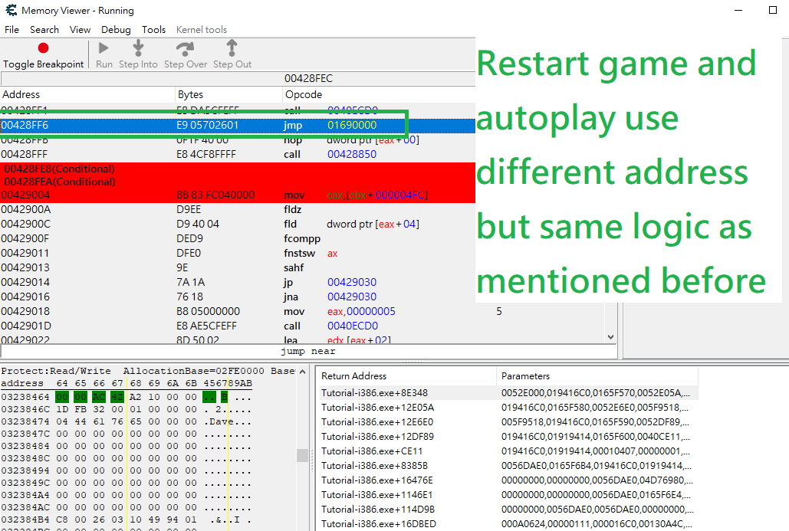
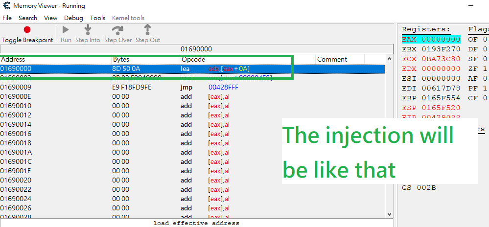

# Game hacking - Cheat Engine Tutorial - Step 9 Write-up

## Instruction:

## Attack button:

eax is the key parameter passed to function 0x0040ECD0 controlling the decrement in Eric Health\(the decrement value is saved in EDX\), moving a smaller value into eax will significantly decrease the decrement in that player health  \(noticing that there are 4 different function handling Eric, Dave, HAL, KIT\). Thus, using code injection in cheat engine modifying

"mov eax, 00000005" -&gt; "mov eax, 00000001" \(Eric and Dave\) 

"mov eax, 00000005" -&gt; "mov eax, 000000FF" \(HAL and KITT\)

## Restart game and autoplay:

